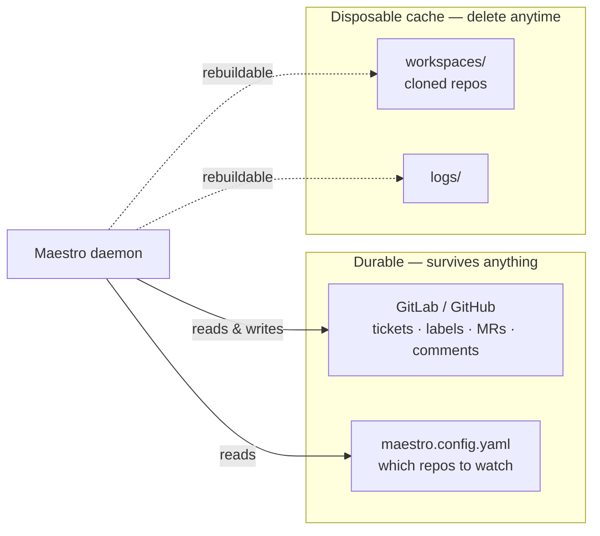
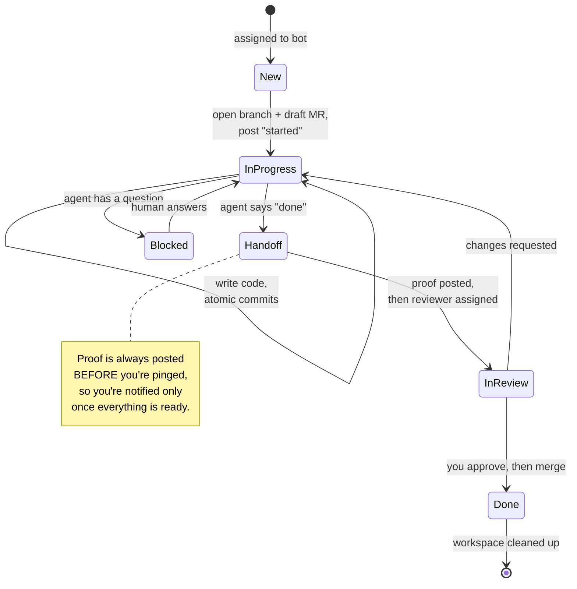
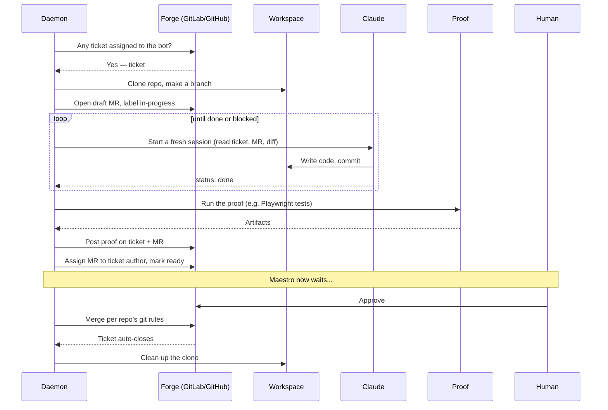
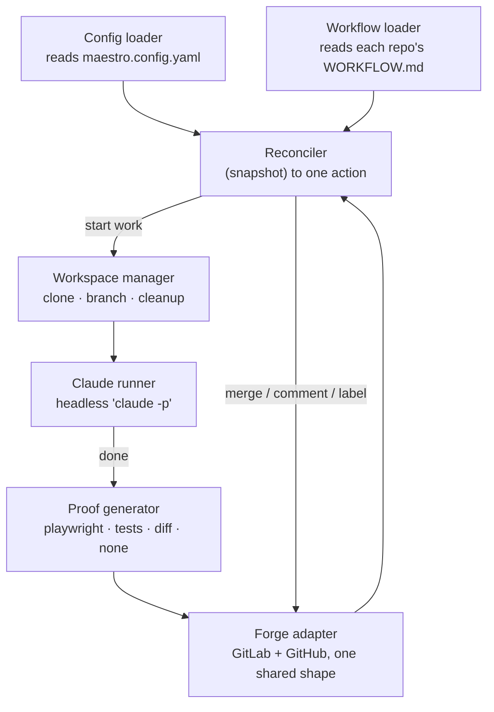
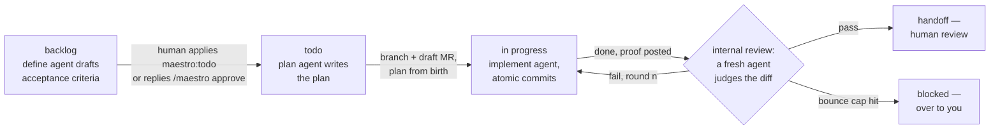
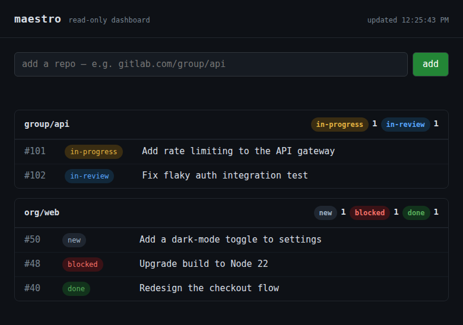
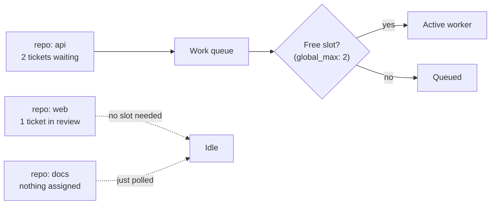

# Maestro

Maestro is a robot teammate for your code repositories. You assign it a ticket,
and it does the work: it opens a branch, writes the code with Claude, proves the
change works, and then hands the result back to you for review. Once you approve,
it merges. If it gets stuck or has a question, it asks and waits.

It works on top of **GitLab** and **GitHub**. You keep using issues and merge
requests the way you already do. Maestro just becomes another contributor on the
team — one that happens to be an AI.

> **Where the build is:** the full v1 lifecycle (M0–M8) is implemented and
> tested. The pieces that talk to a *live* forge and run a *real* Claude session
> end-to-end are gated behind environment flags and wait on a scratch repo +
> token to exercise. Everything below describes the intended, built behaviour.

---

## The one-paragraph version

You run a single long-lived program (the **daemon**) on a machine you control.
It reads a config file listing which repos to watch. Every so often it looks at
each repo and asks: *is there a ticket here assigned to my bot account?* If yes,
it picks it up and walks it through a fixed set of steps — write code, prove it,
ask for review, merge. The clever part is that Maestro keeps **almost no memory
of its own**. Everything it needs to know lives in the ticket, the merge request,
and the git history. So if the daemon crashes or you reboot the machine, it just
re-reads the repo and carries on exactly where it left off.

---

## Why it's built this way

Two ideas drive the whole design.

**1. The forge is the memory.** Maestro doesn't run a database. The "state" of
any ticket — whether it's new, in progress, waiting for review, or done — is
written directly into the forge as labels, merge-request status, and comments.
Anything stored on the local disk (cloned repos, log files) is treated as a
throwaway cache that can be deleted and rebuilt at any time.



Because of this, a multi-day wait for a human reviewer costs nothing. The daemon
can die, sit idle for a week, then wake up and rebuild every ticket's status from
the forge.

**2. The AI starts fresh every time.** Maestro never tries to "resume" a Claude
session. Each time it needs the agent, it starts a brand-new, cold session. The
agent re-learns what it's doing by reading three things: the ticket, the merge
request description (which doubles as its to-do list), and the recent git diff.
This sounds wasteful but it's actually robust — there's no fragile session to
lose, and a human can read the exact same three sources to understand what
happened. Anything that should outlive a single ticket — coding conventions,
decisions the team has locked in — belongs in the repo's own `CLAUDE.md`, which
the cold agent reads automatically on every run (see [Repo-specific
conventions](#repo-specific-conventions)).

---

## The lifecycle: how a ticket becomes a merge

Every ticket moves through the same set of stages. The stage is visible as a label
on the ticket (`maestro:in-progress`, `maestro:in-review`, and so on — on GitLab
they appear scoped, as `maestro::in-progress`), so you can see it at a glance on
your board. This is the default single-agent flow; a
repo can opt into a longer pipeline with separate define, plan, implement, and
review agents — see [Per-role prompts and the stage
pipeline](#per-role-prompts-and-the-stage-pipeline-29) below.



In words:

- **New** — A ticket assigned to the bot, with no Maestro label yet. The daemon
  creates a branch and a *draft* merge request, labels it in-progress, posts a
  "started" comment, and begins work.
- **In progress** — The agent works the ticket one small commit at a time, ticking
  off items in its to-do list (which lives in the MR description) and posting the
  occasional progress note.
- **Handoff** — A brief, behind-the-scenes step. The agent says it's done, so
  Maestro generates *proof* (see below), posts it, **then** assigns the merge
  request to whoever opened the ticket and marks it ready for review. The order
  matters: you're pinged last, when there's actually something to look at.
- **In review** — Maestro waits. If you approve, it merges using that repo's own
  git rules and the ticket auto-closes. If you request changes, it flips back to
  in-progress and feeds your feedback to the agent.
- **Blocked** — The agent hit something it can't decide on its own. It posts the
  question and waits for a human. No slot is consumed while it waits.
- **Done** — Ticket closed, local workspace cleaned up.

---

## What happens during one "tick"

The daemon runs on a loop. One pass over the repos is called a **tick**. Here's
what a single ticket looks like as it gets picked up and worked:



The only thing the daemon ever hears back from Claude is a tiny status:
`done`, `needs_input`, or `in_progress` (a review session adds its pass/fail
verdict). Everything else it learns by reading the forge on the next tick.

---

## The pieces inside

Maestro is a set of small, independently testable parts. The most important one
is the **reconciler** — the "brain" that, given a snapshot of a ticket, decides
the single next action. It's pure logic with no side effects, which is why it can
be tested exhaustively and why it never changed when GitHub support was added on
top of GitLab.



- **Forge adapter** — The only part that knows the difference between GitLab and
  GitHub. It translates each into one shared shape so nothing above it has to
  care which forge a repo lives on.
- **Reconciler** — Pure decision-making. Takes a ticket snapshot, returns at most
  one action per tick.
- **Workspace manager** — Clones a repo into a per-ticket folder, handles the
  branch, cleans up when the ticket is done. This is also the seam where, later,
  you could swap host folders for isolated containers.
- **Claude runner** — Runs the same `claude` binary you use interactively, but
  headless. Locally it uses your existing login and still loads your `CLAUDE.md`,
  settings, skills, and permission modes.
- **Proof generator** — Pluggable per repo. Pick `playwright`, `test-output`,
  `diff-summary`, or `none`.
- **CLI and Web** — Thin shells over the shared core (see below).

---

## Prerequisites

Maestro is an orchestrator — it drives a handful of command-line tools rather than
reimplementing them. These need to be installed and on your `PATH` before the
daemon will run:

| Tool | Why | Install |
|---|---|---|
| **Node.js ≥ 20** + **pnpm** | runs Maestro itself | [nodejs.org](https://nodejs.org) · [pnpm.io](https://pnpm.io/installation) |
| **git** | clone and branch each ticket's workspace | your package manager |
| **claude** | the coding agent, run headless | [Claude Code](https://claude.com/claude-code) |
| **glab** | talk to the GitLab API — *only if you watch GitLab repos* | [gitlab.com/gitlab-org/cli](https://gitlab.com/gitlab-org/cli) |
| **gh** | talk to the GitHub API — *only if you watch GitHub repos* | [cli.github.com](https://cli.github.com) |

You don't need to log into `glab`/`gh` — Maestro injects the token itself (from
its environment, loaded from your `.env`). It only needs the binaries present. Run **`maestro doctor`** at any
time to check what's missing; the daemon also runs this check on startup and
refuses to boot (with a clear message) if a required tool is absent.

---

## Getting started

The fast path from a fresh clone to a running daemon and dashboard.

```sh
# 1. Clone and set up (installs deps, builds, scaffolds .env, checks your tools)
git clone https://github.com/l4ci/maestro.git
cd maestro
./scripts/setup.sh

# 2. Add your secrets — paste the bot account's token(s)
$EDITOR .env                 # MAESTRO_GITLAB_TOKEN / MAESTRO_GITHUB_TOKEN

# 3. Point Maestro at your forge(s) — host + which env var holds each token
$EDITOR maestro.config.yaml  # (see "Setting it up" below for the full schema)

# 4. Confirm every required tool is on PATH
node packages/cli/dist/cli.js doctor

# 5. Connect your first repo (creates its labels/board, commits the config change)
node packages/cli/dist/cli.js add gitlab.com/your-group/your-repo

# 6. Load the tokens into your shell, then start the daemon
set -a; . ./.env; set +a
node packages/cli/dist/cli.js daemon

# 7. In another terminal, start the dashboard and open it in a browser
node packages/cli/dist/cli.js dashboard    # → http://127.0.0.1:4000
```

That's the whole loop. Assign an issue on your repo to the bot account, and watch
its state move across the dashboard as Maestro picks it up, works it, and hands it
back for review.

> **Tip — a shorter `maestro`:** `./scripts/setup.sh` links the CLI onto your
> PATH automatically when pnpm has a global bin dir (`pnpm setup` creates one —
> then re-run the setup script, or run `pnpm -C packages/cli link --global`
> yourself). No global bin dir? Alias it instead:
> `alias maestro='node /path/to/maestro/packages/cli/dist/cli.js'`.

---

## Setting it up

There are two config files. One is global to your Maestro install; the other
lives inside each repo you want watched.

### 1. The global config — `maestro.config.yaml`

This lists your repos and global defaults. It's committed to git. **Secrets never
go here** — the config only names the *environment variable* that holds a token,
never the token itself.

```yaml
defaults:
  poll_interval_active: 30s   # how often to check repos with live work
  poll_interval_idle: 5m      # how often to check quiet repos
  bot_user: maestro-bot
  concurrency:
    global_max: 2             # how many tickets to actively work at once
forges:
  # Single entry per forge (shorthand)
  gitlab: { host: gitlab.com, token_env: MAESTRO_GITLAB_TOKEN }
  github: { host: github.com, token_env: MAESTRO_GITHUB_TOKEN }
repos:
  - url: gitlab.com/group/api
  - url: github.com/org/web
```

The actual token values go in a `.env` file, which is gitignored:

```sh
cp .env.example .env
# then fill in MAESTRO_GITLAB_TOKEN / MAESTRO_GITHUB_TOKEN
```

### 2. The per-repo config — `WORKFLOW.md`

Each watched repo carries its own `WORKFLOW.md`, version-controlled alongside the
code. It tells Maestro how *that* repo wants to be worked: which branch to target,
how to merge, how to prove a change works, and any house rules for the agent
(test commands, conventions, definition of done). The prompt body of this file is
the agent's operating manual. When you run `maestro add`, a sensible default is
generated for you from a template.

---

### Per-role prompts and the stage pipeline (#29)

A `WORKFLOW.md` body may declare role sections:

```markdown
Shared conventions every agent gets.

## role: define
Refine the request into acceptance criteria. Ask, don't assume.

## role: plan
Produce the implementation plan and the checkbox todo.

## role: implement
Execute the plan, one atomic commit per step.

## role: review
Judge the diff against the plan. Block on real problems, not taste.
```

Text above the first role heading is shared by every agent. A repo **without**
role sections keeps the original single-agent flow unchanged — roles are opt-in
per repo.

Declaring roles replaces the single generalist agent with a staged pipeline,
where each stage runs a cold session with only its own instructions:



- **Backlog** — new issues land here. The define agent refines the request into
  acceptance criteria and posts them as an issue comment. Then it waits for a
  human: apply the `maestro:todo` label (the daemon never sets that label itself,
  so its presence proves a person signed off) or reply `/maestro approve`.
  Labelling the issue `maestro:todo` at creation skips definition entirely.
- **Todo** — the plan agent writes the implementation plan. Only after that does
  Maestro create the branch and draft MR, so the MR carries the plan from its
  first second.
- **In progress** — implementation, as before. But when the agent says "done",
  you are not pinged yet.
- **Internal review** — Maestro posts the proof, then starts a *separate* cold
  session whose only job is to judge the diff. Pass → the normal handoff: you're
  assigned, the MR is marked ready. Fail → the findings land as an issue comment
  ("round 1", "round 2", …) and the implement agent picks them up next tick.
  After `review.max_rounds` consecutive fails (default 3, configurable in the
  front matter), Maestro stops bouncing and flips the ticket to blocked with a
  summary — it never auto-merges and never silently drops work. Any comment from
  you resets the round count and resumes the loop.

The labels you'll see on a roled repo, in board order:

| Label | Meaning | Who sets it |
|---|---|---|
| `maestro:backlog` | being defined | daemon |
| `maestro:todo` | definition approved, awaiting plan | **a human** — this is the approval gate |
| `maestro:in-progress` | plan landed, implementation underway | daemon |
| `maestro:in-review` | proof posted; internal then human review | daemon |
| `maestro:blocked` | a question (or the bounce cap) needs a human | daemon |
| `maestro:queued` | wants a slot, none free | daemon |

`maestro:queued` is a capacity marker, not a stage: it can sit alongside any of
the others, means only "waiting for a free concurrency slot", and is retracted
when work actually starts (or when you unassign the bot). On GitLab the labels
are scoped (`maestro::backlog`), so they exclude each other automatically.

One design note worth knowing: in a roled repo the labels are *projections* for
your board, not the daemon's memory. The stage is re-derived every tick from
artifacts — does an MR exist, is it still a draft, was the AC draft approved —
so a crashed daemon, a stripped label, or an unblocked ticket all recover to
exactly the right place. The one exception is `maestro:todo`, which is itself an
artifact: a human put it there.

## A walkthrough of the default `WORKFLOW.md`

A `WORKFLOW.md` has two parts: a **front-matter block** (the settings, in YAML
between the `---` fences) and a **prompt body** (plain Markdown below the fences,
which becomes the agent's instructions). Here's the default, annotated.

### The front matter — settings

```yaml
---
forge: gitlab                  # gitlab | github (guessed from the repo's host if left out)
project: group/repo            # GitLab path, OR GitHub org/repo
bot_user: maestro-bot          # the account tickets get assigned to
manage_board: true             # auto-create the labels (and, on GitLab, the board lists)

trigger:                       # the gate for what the bot is allowed to pick up
  assignee: bot                #   the ticket must be assigned to bot_user
  require_label: null          #   optional: also require this maintainer-added label
  allowed_actors: []           #   optional: only trust triggers from these users (turn ON for public repos)

proof:                         # how this repo proves a change works
  type: playwright             #   playwright | test-output | diff-summary | none
  command: "npx playwright test --reporter=line"

git:                           # this repo's own merge rules
  default_branch: main
  target: main                 #   which branch the MR/PR targets
  merge_strategy: squash       #   squash | merge | rebase
  delete_source_branch: true

environment:                   # how to reach or boot a running instance (for proof)
  base_url: http://localhost:3000   #   an already-running local instance, if any
  start_command: "npm run dev"      #   else, how to start one
  seed_command: "npm run db:seed"   #   load sample/dummy data
  health_check: "curl -sf localhost:3000/health"

claude:                        # how the agent runs
  command: "claude"            #   same binary as interactive; the daemon runs it headless
  max_turns: 40                #   safety cap on how long one session can churn
  permission_mode: acceptEdits #   how much the agent may do without asking

concurrency:
  max_active: 2                # most tickets this one repo will work at once
---
```

The blocks worth understanding:

- **`trigger`** is your safety gate. By default a ticket just needs to be assigned
  to the bot. For anything public, turn on `require_label` and/or `allowed_actors`
  so a stranger can't kick off work by assignment alone.
- **`proof`** is how Maestro *demonstrates* the change is good before pinging you.
  `playwright` runs browser tests, `test-output` runs your test suite, `diff-summary`
  just summarizes the change, and `none` skips it.
- **`environment`** only matters when proof needs a running app. If you already
  keep a local instance up, point `base_url` at it; otherwise Maestro uses
  `start_command` to boot one, `seed_command` to fill it with data, and
  `health_check` to know it's ready.
- **`git`** lets each repo keep its own merge habits — Maestro never imposes one
  global rule.

### The prompt body — the agent's instructions

Below the second `---` is plain Markdown that becomes the agent's operating
manual. The template ships with a shared spine (the same six steps from the
lifecycle above) plus a spot for your repo's house rules:

```markdown
# Agent operating protocol

You are working a single issue end-to-end in a cold session. Reconstruct all
context from the issue, the MR description (your durable plan/todo), recent
commits + diff, and the repo conventions below.

1. Orient — read the issue, the MR description, recent commits + diff, and the
   conventions in this file.
2. First session only — gather context. If the task is ambiguous, post a comment
   with questions, set maestro:blocked, and stop. Otherwise, write a plan +
   checkbox todo list into the MR description.
3. Work the next unchecked item — one atomic commit per meaningful step.
4. After each step — tick the box in the MR description; post a short progress
   comment if notable.
5. Done — all boxes checked + definition-of-done met → emit done.
6. Blocked anytime — need a human decision → comment the question, label
   maestro:blocked, stop.

## Repo-specific conventions

- Test: `npm test`
- Lint: `npm run lint`
- Definition of done: tests + lint green; proof attached; MR todo all checked.
```

**You mostly edit the bottom section.** The numbered protocol is the shared
default — leave it alone unless you have a reason. The "Repo-specific conventions"
block is where you teach the agent about *this* codebase: the exact test and lint
commands, architecture notes, naming rules, and what "done" means here. Whatever a
new human teammate would need to know on day one belongs there.

> **Why the MR description matters so much:** notice that step 2 puts the plan and
> to-do list *into the MR description*, not into the agent's memory. That's
> deliberate. Because the agent starts cold every session, the MR description is
> its only durable scratchpad — and it's one you can read too. Open the MR and you
> see exactly what the agent thinks it's doing and how far along it is.

> **A second channel — `CLAUDE.md`.** The conventions block above rides in the
> WORKFLOW.md body, so Maestro is the one injecting it. But the agent is Claude
> Code, and Claude Code loads a `CLAUDE.md` from the repo root on its own, every
> run, with no help from Maestro. That makes `CLAUDE.md` the home for durable,
> repo-owned knowledge: conventions, decisions the team has settled, architecture
> notes, links into `docs/` or your ADRs. And because a `CLAUDE.md` can point at
> other files, you can wire up a whole tree of standing context and keep all of it
> in git. It fits *the forge is the memory*: the knowledge survives because it's
> committed, and it changes only when an MR merges it.

---

## Running it

The daemon is one process that watches **all** your repos. You never run one
daemon per repo.

```sh
# load the forge tokens, then start the daemon (watches everything in the config)
set -a; . ./.env; set +a
maestro daemon
```

The daemon reads tokens from its environment, not from the `.env` file directly —
hence the `source` line (a [service](#keeping-it-running-background-and-boot)
does this for you via `EnvironmentFile=`).

On startup it preflights your tools (`git`, `claude`, and the forge binaries you
need) and refuses to boot if any are missing — so a misconfigured host fails fast
with a clear message instead of silently looping.

Day-to-day you'll mostly use the CLI:

| Command | What it does |
|---|---|
| `maestro daemon` | Start the daemon — one process that watches every repo in the config and works assigned issues. Preflights tools, then loops. |
| `maestro add <url>` | Start watching a repo. Sets up its labels/board and commits the config change. Add `--public` to opt into a public repo (read the safety notes first). |
| `maestro list` | Show all watched repos and what's in flight. |
| `maestro status <issue>` | Show one ticket's current stage. |
| `maestro logs <issue>` | Show the agent's logs for a ticket. |
| `maestro run <issue> --attach` | Open an **interactive** Claude in that ticket's workspace so you can watch or drive it by hand. Local-dev only, not the daemon path. |
| `maestro dashboard` | Start the web dashboard (same as `node packages/web/dist/main.js`) — see below. |
| `maestro doctor` | Check that every required tool (`git`, `claude`, `glab`/`gh`) is on your `PATH`. Exits non-zero if anything's missing. |

### The dashboard

A small read-only **web dashboard** shows the same information in your browser —
a live status table of every watched repo and its tickets, plus an "add a repo"
form — and auto-refreshes every few seconds.



*Example view — each ticket shows its current lifecycle state, and each repo
summarises its counts. A repo whose forge can't be reached shows as "unreachable"
instead of looking idle.*

```sh
maestro dashboard      # → http://127.0.0.1:4000
```

Override the bind address with `MAESTRO_WEB_HOST` / `MAESTRO_WEB_PORT`. The same
endpoint also serves the raw read-model as JSON to any non-browser client (handy
for scripting), so `curl localhost:4000` gives you the data the page renders.

**Adding repos from the dashboard is off by default.** The `GET` paths are
read-only and always open, but `POST /repos` (the "add a repo" form) mutates your
config and creates labels plus a bootstrap issue/PR on the forge — so it stays
disabled unless you opt in by setting `MAESTRO_DASHBOARD_TOKEN`:

```sh
MAESTRO_DASHBOARD_TOKEN="$(openssl rand -hex 32)" maestro dashboard
```

With no token set the write path doesn't exist (a `POST /repos` returns `404`) and
the add-repo form is hidden. With a token set, the form appears and each add must
carry it as `Authorization: Bearer <token>` (compared in constant time); a missing
header is `401`, a wrong token `403`. This keeps a read-only dashboard safe to
expose on a shared tailnet/LAN while gating the one write path behind a secret. On
an untrusted network, still prefer binding `127.0.0.1` and fronting it with
`tailscale serve` + ACLs.

### Keeping it running: background and boot

`maestro daemon` runs in the foreground. For a quick detached session, `tmux`
(or `nohup maestro daemon &`) does the job — but it dies with the machine. The
proper way to survive reboots is a systemd **user** service; the repo ships a
ready unit at [`templates/maestro.service`](templates/maestro.service):

```sh
mkdir -p ~/.config/systemd/user
cp templates/maestro.service ~/.config/systemd/user/
$EDITOR ~/.config/systemd/user/maestro.service   # set the three EDIT lines (paths)
systemctl --user daemon-reload
systemctl --user enable --now maestro

# start at boot without anyone logging in
loginctl enable-linger $USER

# watch it
journalctl --user -u maestro -f
```

Three things the unit handles that a bare `nohup` doesn't:

- **Tokens.** Nothing in Maestro reads the `.env` file itself — the tokens must
  be in the daemon's process environment. In the foreground you load them into
  your shell once (`set -a; . ./.env; set +a`); the unit does it declaratively
  with `EnvironmentFile=`.
- **PATH.** The daemon shells out to `git`, `claude`, `glab`/`gh`, and a systemd
  user session's default `PATH` misses the usual homes of two of them
  (`~/.local/bin` for claude, `/snap/bin` for glab). The unit extends `PATH`;
  if a tool still can't be found, the startup preflight fails fast and names it.
- **Restarts.** `Restart=on-failure` is safe precisely because of the design
  above: the daemon keeps no state of its own, so a restarted process re-reads
  the forge and picks up every ticket where it left off.

A user service (not a system one) is deliberate: the daemon runs Claude with
*your* login and settings, so it should run as your user, not root.

---

## How the daemon decides what to work on

You can watch a hundred repos on a tiny machine. The thing that costs real
resources isn't *watching*, it's *working*. A repo with nothing assigned, or a
ticket sitting in review, costs only a cheap periodic check. Compute is spent only
while a ticket is actively being worked, and each active ticket holds one "slot".



If more tickets are ready than you have slots, the extras simply queue — and get
the `maestro:queued` label, so the queue is visible on the forge instead of
looking like silence. Nothing breaks — throughput is just capped. The right
number of slots depends on your machine's RAM, since each active worker runs
Claude plus possibly a browser for proof. On a 4 GB box, 1–2 is sensible.

To scale up, you don't add daemons — you add **machines**, each running its own
single daemon watching a few repos. They never coordinate with each other; the
forge is the shared source of truth, so there's nothing to sync.

---

## Maestro can manage itself

The Maestro project is just a git repo, which means Maestro can watch *itself*.
Want to add a repo or bump concurrency? File a ticket on the Maestro repo. The
agent edits `maestro.config.yaml`, opens a merge request, you approve, it merges,
and the daemon hot-reloads the new config. There's no separate admin panel —
managing Maestro *is* using Maestro.

---

## A note on safety

Maestro runs autonomous Claude (and possibly a browser for proof) directly on the
host machine, unsandboxed. For your own **private** repos with a dedicated bot
account, that's a reasonable tradeoff. For **public** repos it's riskier, and
support for them is deliberately opt-in (`--public`):

- **Who can start work** is gated by forge permissions — assigning a ticket to the
  bot requires write/triage access. You can tighten this further with a required
  label or an allowlist of trusted users.
- **What a ticket says** is the harder problem. On a public repo, ticket text is
  written by strangers, and the agent acts on it with the bot's credentials. The
  real fix is per-ticket container isolation, which is a planned future step. Until
  then, treat public-repo support as experimental and keep secrets out of the
  workspace.
- **Permission mode.** Headless, the agent has no human to approve tool calls, so
  it ships defaulting to `bypassPermissions` (`--dangerously-skip-permissions`) —
  otherwise it can't even `git commit` its work or run a proof. That means it runs
  unsandboxed Bash on the host. Fine for a private repo you trust; for a public one,
  override `claude.permission_mode` to a constrained mode (`acceptEdits`/`default`)
  and accept that the agent can't commit or prove until the container sandbox lands.

---

## For developers

It's a pnpm + TypeScript monorepo.

```
packages/core   the brain: reconciler, forge adapters, Claude runner, proof,
                config + workflow loaders, daemon loop, tool preflight
packages/cli    maestro add | status | list | logs | run | dashboard | doctor + daemon entry
packages/web    read-only dashboard (HTML page + JSON API) + add-repo form
templates/      the default WORKFLOW.md used when onboarding a repo
scripts/        setup.sh — one-shot install + build + tool check
```

The CLI and web packages are intentionally thin — almost all real logic lives in
`core` so both interfaces behave identically.

```sh
pnpm install
pnpm typecheck   # strict TypeScript
pnpm test        # vitest
pnpm lint        # biome
pnpm build       # per package
```

### Where to read more

- **Design spec (the locked source of truth):**
  [`docs/superpowers/specs/2026-06-03-maestro-design.md`](docs/superpowers/specs/2026-06-03-maestro-design.md)
- **Build roadmap and milestone history:** [`tasks/todo.md`](tasks/todo.md)
- **Architecture vocabulary and settled seams:** [`CONTEXT.md`](CONTEXT.md)
